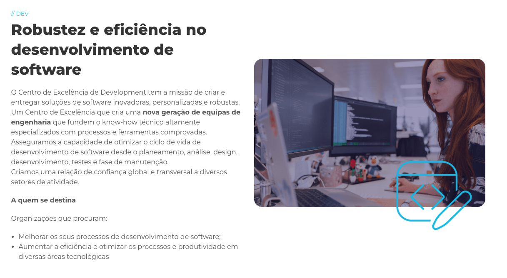
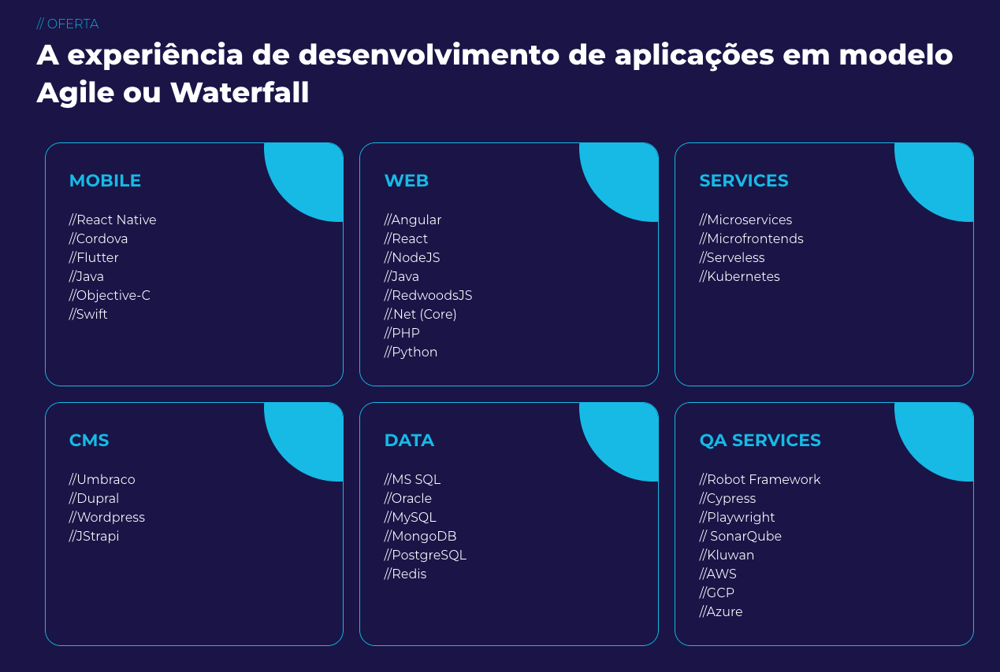

Teste

O Centro de Excelência de Development tem a missão de criar e entregar soluções de software inovadoras, personalizadas e robustas.
Um Centro de Excelência que cria uma nova geração de equipas de engenharia que fundem o know-how técnico altamente especializados com processos e ferramentas comprovadas.
Asseguramos a capacidade de otimizar o ciclo de vida de desenvolvimento de software desde o planeamento, análise, design, desenvolvimento, testes e fase de manutenção.
Criamos uma relação de confiança global e transversal a diversos setores de atividade.

A quem se destina

Organizações que procuram:

Melhorar os seus processos de desenvolvimento de software;
Aumentar a eficiência e otimizar os processos e produtividade em diversas áreas tecnológicas

